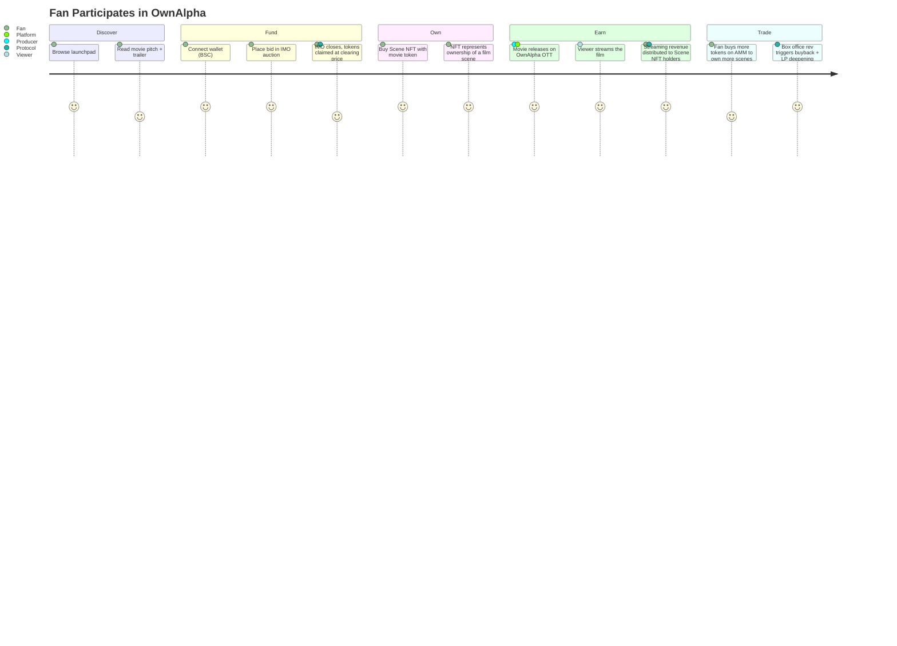
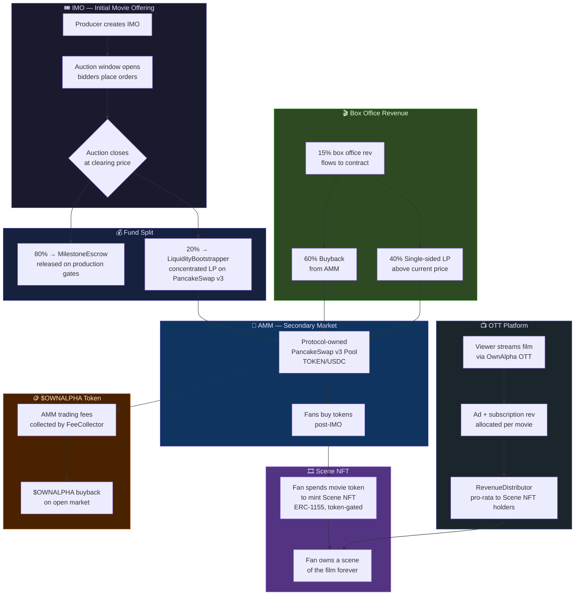
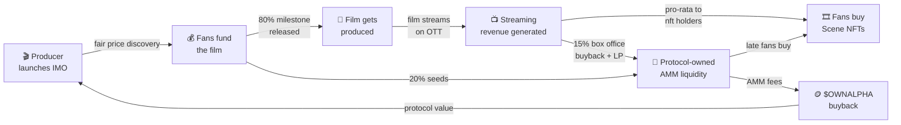

# 🎬 OwnAlpha — The Onchain Film Studio

> **Fund movies. Own scenes. Earn every time someone watches.**

OwnAlpha is a decentralized movie launchpad on BNB Chain where fans participate in **Initial Movie Offerings (IMOs)**, own tokenized film scenes as NFTs, and receive **real streaming revenue share** every time their film is watched on the OwnAlpha OTT platform.

We are not a speculation platform. Movie tokens have one mandatory use — buying Scene NFTs — which unlocks perpetual streaming revenue. The AMM exists so late fans can join a film they love, not to gamble on price.

---

## The Problem → Solution in One Line  

| ❌ Today | ✅ OwnAlpha |
|---|---|
| Fans watch movies. Studios capture 100% of value. | Fans fund movies, own scenes, and earn every stream — forever. |

---

## Who Is This For?

| User | What They Get |
|---|---|
| 🎥 **Film Producers** | Decentralized crowdfunding at fair market price; milestone-gated capital release |
| 🎟️ **Film Fans** | Own a piece of the film; earn streaming revenue share from every watch |
| 💹 **DeFi Users** | Participate in an IMO auction; trade movie tokens on the AMM post-launch |
| 🏗️ **$OWNALPHA Holders** | Protocol fees from all movie AMM pools flow back to the protocol token |

---

## Core Value Propositions

**For producers:** Raise capital in a transparent, market-priced public auction. No VCs, no gatekeepers. 80% of raised funds released in production milestones. The community that funded you is also your distribution network.

**For fans:** The only way to own a Scene NFT — which earns real streaming revenue — is via the movie token. This creates intrinsic, non-speculative demand that persists long after the IMO closes.

**For the ecosystem:** Every movie that launches on OwnAlpha generates AMM trading fees. Those fees compound into $OWNALPHA buybacks, making the protocol token a claim on the aggregate success of every film on the platform.

---

## Quick Links

| Resource | Link |
|---|---|
| 🌐 Live Demo | https://ownalpha-ie1i.vercel.app/ |
| 📄 Project Details | [`docs/PROJECT.md`](docs/PROJECT.md) |
| 🔧 Technical Docs | [`docs/TECHNICAL.md`](docs/TECHNICAL.md) |
| 🎥 Demo & Slides | [`docs/EXTRAS.md`](docs/EXTRAS.md) |
| 📋 Contract Addresses | [`bsc.address`](bsc.address) |

---

## User Journey (Mermaid)



---

## System Architecture



---

## The Flywheel



---

## Tech Stack

| Layer | Technology |
|---|---|
| Frontend | Next.js 14, TypeScript, Tailwind CSS |
| Web3 | wagmi, viem |
| Smart Contracts | Solidity, BNB Chain (BSC) |
| DEX / AMM | PancakeSwap v3 (concentrated liquidity) |
| Token Standards | ERC-20 (movie tokens), ERC-1155 (scene NFTs) |
| Auction Mechanism | CCA-inspired pro-rata clearing auction |

---

## Repo Structure

```
ownalpha/
├── src/                   # Next.js 14 App Router frontend
│   ├── app/               # Pages & routing
│   ├── components/        # UI components
│   ├── hooks/             # Web3 / wagmi hooks
│   ├── lib/               # ABIs, chain config, helpers
│   └── types/             # TypeScript types
├── scripts/               # Deployment & contract interaction scripts
├── public/                # Static assets
├── docs/
│   ├── PROJECT.md         # Problem, solution, business model, limitations
│   ├── TECHNICAL.md       # Architecture deep-dive, setup, demo guide
│   └── EXTRAS.md          # Demo video & presentation links
├── bsc.address            # Deployed contract addresses
├── check-contract.js      # Deployment verification utility
├── next.config.ts
└── package.json
```

---

This is a [Next.js](https://nextjs.org) project bootstrapped with [`create-next-app`](https://nextjs.org/docs/app/api-reference/cli/create-next-app).

## Getting Started

First, run the development server:

```bash
npm run dev
# or
yarn dev
# or
pnpm dev
# or
bun dev
```

Open [http://localhost:3000](http://localhost:3000) with your browser to see the result.

You can start editing the page by modifying `app/page.tsx`. The page auto-updates as you edit the file.

This project uses [`next/font`](https://nextjs.org/docs/app/building-your-application/optimizing/fonts) to automatically optimize and load [Geist](https://vercel.com/font), a new font family for Vercel.

## Learn More

To learn more about Next.js, take a look at the following resources:

- [Next.js Documentation](https://nextjs.org/docs) - learn about Next.js features and API.
- [Learn Next.js](https://nextjs.org/learn) - an interactive Next.js tutorial.

You can check out [the Next.js GitHub repository](https://github.com/vercel/next.js) - your feedback and contributions are welcome!

## Deploy on Vercel

The easiest way to deploy your Next.js app is to use the [Vercel Platform](https://vercel.com/new?utm_medium=default-template&filter=next.js&utm_source=create-next-app&utm_campaign=create-next-app-readme) from the creators of Next.js.

Check out our [Next.js deployment documentation](https://nextjs.org/docs/app/building-your-application/deploying) for more details.


## License

MIT
