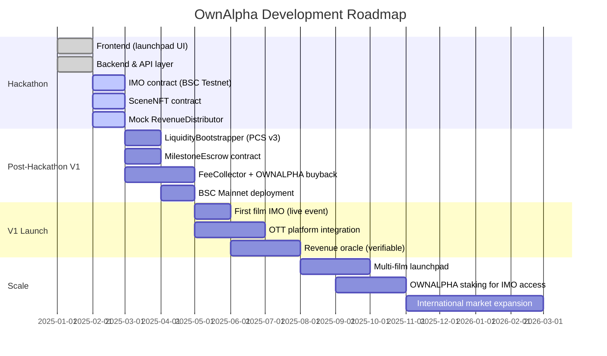

# OwnAlpha — Project Details

## Problem

### The Film Financing Problem
The global film industry generates over $100B in annual revenue. Almost none of it reaches the fans who drive that value.

- **For producers:** Raising capital means navigating gatekeepers — studios, VCs, equity crowdfunding platforms with high regulatory overhead and no secondary liquidity. Indie filmmakers especially have no good path to community capital.
- **For fans:** Fans spend billions watching films, merchandising, and streaming — yet have zero claim to the financial upside they create. There is no mechanism that connects financial support directly to ongoing revenue rights.
- **For the crypto ecosystem:** Token launches for creative projects (pump.fun, Zora) optimize for speculation or liquidity depth, not utility. Tokens that have no floor use case beyond "number go up" are not sustainable.

### The Specific Gaps

| Gap | Impact |
|---|---|
| No fair-price mechanism for community film funding | Insiders capture disproportionate early allocation |
| No tokenized scene ownership with enforced utility | Tokens become pure speculation with no demand floor |
| No streaming revenue share tied to onchain ownership | Fans can't earn from the success of films they love |
| No producer accountability mechanism post-raise | Capital can be misused without recourse |

---

## Solution

OwnAlpha is a three-layer protocol:

### Layer 1 — Initial Movie Offering (IMO)
A **Continuous Clearing Auction (CCA)** inspired mechanism where producers commit a token supply tranche to a public, time-bounded auction on BSC. Bidders place orders across the auction window; each block clears at the market-discovered price. No sniping, no insider allocation, no arbitrary floor set by the team.

At auction close:
- **80%** of raised funds flow to `MilestoneEscrow` — released in tranches as the producer hits production checkpoints (greenlit by legal smart contract conditions)
- **20%** seeds a **Graduated Concentrated LP** on PancakeSwap v3, centered at the auction's clearing price ±30%. This gives deep liquidity exactly where price discovery happened — far more capital-efficient than a standard bonding curve

### Layer 2 — Scene NFT + AMM
The movie token has **one enforced use case**: purchasing a Scene NFT (ERC-1155). This creates a non-speculative demand floor. Fans who missed the IMO can acquire tokens from the protocol-owned AMM pool.

The AMM is not a speculation venue. It exists so that:
- Late fans can participate in films they discover after launch
- Scene ownership can accumulate over time as films prove their value

### Layer 3 — OTT + Streaming Revenue Share
OwnAlpha operates its own OTT streaming platform (subscription model, separate revenue). When a film is streamed, ad and subscription revenue attributed to that movie flows into a `RevenueDistributor` contract. Scene NFT holders claim pro-rata streaming revenue every epoch.

The producer separately commits **15% of box office revenue** to the token contract. This is split:
- 60% → buyback tokens from the AMM (reduces supply, supports price)
- 40% → single-sided concentrated LP above market price (pre-seeds liquidity at higher bands as the film's success pushes demand up)

---

## Target Users

### Primary

**Film Fans (Crypto-native, 18–35):** People who are passionate about films and want financial skin in the game — not just watching, but owning. They understand wallets and DeFi but are motivated by the film, not the token ticker.

**Independent Film Producers:** Filmmakers who need community capital, want to bypass traditional gatekeepers, and can commit to transparent milestone delivery. Particularly well-suited for international producers who lack access to Western VC/studio networks.

### Secondary

**DeFi Yield Seekers:** Attracted by the streaming revenue share mechanic — a real, verifiable yield source tied to OTT performance rather than inflationary token rewards.

**$OWNALPHA Holders:** Platform-level investors who want exposure to the aggregate success of all films on OwnAlpha, capturing protocol fee buybacks across every movie pool.

---

## Business Model

### Protocol Revenue Streams

| Source | Mechanism | Rate |
|---|---|---|
| IMO Deposit Fee | Per bid placed during auction | 1% of deposit |
| IMO Success Fee | On successful raise close | 2.5% of total raised |
| AMM Fee Capture | Protocol owns LP positions → harvests all trading fees | 100% of LP fees (no external LPs) |
| OTT Subscriptions | Subscription model, separate from token economy | Direct B2C revenue |

### $OWNALPHA Token Model

$OWNALPHA is the protocol's value-capture token. It does not gate any feature — it accrues value passively via fee buybacks.

```
All movie AMM pools
        │
        ▼
FeeCollector contract
(harvests PancakeSwap v3 position fees)
        │
        ▼
Open-market $OWNALPHA buyback
        │
        ▼
$OWNALPHA supply decreases
= each token represents a larger share of protocol
```

**Why this works at scale:** Every new movie that launches on OwnAlpha adds another pool generating trading fees. The protocol token becomes an index on the aggregate activity of the entire film platform. As the platform grows, the buyback pressure compounds.

### Movie Token Economics (Per Film)

```
Total Supply: 10,000,000 [MOVIE]
├── IMO Tranche: 40% (4,000,000) → public auction
├── Producer Reserve: 35% (3,500,000) → vested, FDV-gated
├── Scene NFT Redemption Pool: 20% (2,000,000) → locked in NFT contract
└── Platform Index: 5% (500,000) → $OWNALPHA staker allocation
```

Raised funds split: 80% producer (milestone-gated) / 20% LP seed.

---

## GTM Strategy

### Phase 1 — Hackathon Launch (Now)
- Ship working IMO + Scene NFT + mock revenue distributor on BSC Testnet
- Demo at hackathon with a real film pitch (real producer partner preferred)
- Win prize tracks: Auction mechanism, DeFi/AMM, Consumer/Utility

### Phase 2 — First Film (Month 1–3)
- Partner with 1–2 independent film producers who have a completed or near-complete project
- A completed film has the strongest IMO story: backers can see what they're funding
- Run first live IMO — "The Shot"-style livestreamed funding event (modeled on star.fun's success raising $350K in one hour via livestream)
- Film releases on OwnAlpha OTT within weeks of IMO, so revenue share kicks in fast (builds trust with early backers)

### Phase 3 — Crypto-native Film Community (Month 3–6)
- Build distribution through crypto-native film communities, not traditional film forums
- Leverage Scene NFT collectors as organic ambassadors — they have financial incentive to promote every stream
- Integrate $OWNALPHA staking for early access to IMOs (drives protocol token demand)

### Phase 4 — International Expansion (Month 6–12)
- Target markets: India, Southeast Asia, Latin America — large film cultures with underserved indie financing
- BSC is optimal here: low fees, high retail penetration in these regions
- Localized OTT content that global streaming giants ignore = genuine content moat

### Distribution Leverage Points
- **Scene owners = marketing army:** Every scene owner has a financial incentive to share the film. They earn more when more people stream it.
- **Producer network effects:** Successful producers bring their audience to OwnAlpha, not to a generic launchpad. Film communities are sticky.
- **OTT creates retention:** Unlike a token launchpad where there's nothing to do post-launch, fans keep coming back to stream (and earn).

---

## Limitations & Known Risks

### Technical
- **Oracle dependency for revenue distribution:** Box office and streaming revenue requires a trusted oracle or admin call. For v1, this is an admin-posted number. V2 should integrate a verifiable oracle with off-chain revenue attestation.
- **PancakeSwap v3 LP management:** Auto-compounding the concentrated position requires an off-chain keeper. In v1, fees accumulate in the position and are harvested periodically.
- **BSC centralization tradeoff:** BSC is chosen for low fees and retail accessibility but inherits validator centralization. Future chains: opBNB or a rollup may be more appropriate at scale.

### Legal
- **Securities risk:** Movie tokens with revenue rights could be construed as securities in some jurisdictions. Legal team has assessed this and is structuring the producer commitment as a contractual royalty agreement rather than equity — similar to ERC-S's model via SPV. This is an active area of legal work.
- **Producer default risk:** If a producer fails to deliver box office revenue, the buyback commitment cannot be enforced purely on-chain without legal recourse. The milestone escrow mitigates this for production capital, but box office revenue flows post-release.

### Product
- **Cold start for OTT:** The OTT needs content to retain users. Without a library, early adopters have nothing to stream. This is why the first film must be a completed or near-complete project.
- **Scene NFT liquidity:** Scene NFTs are illiquid by design (movie-token gated). There is no secondary market for scenes in v1. This is intentional — scene ownership is meant to be a long-term position, not a flip.

---

## Roadmap


