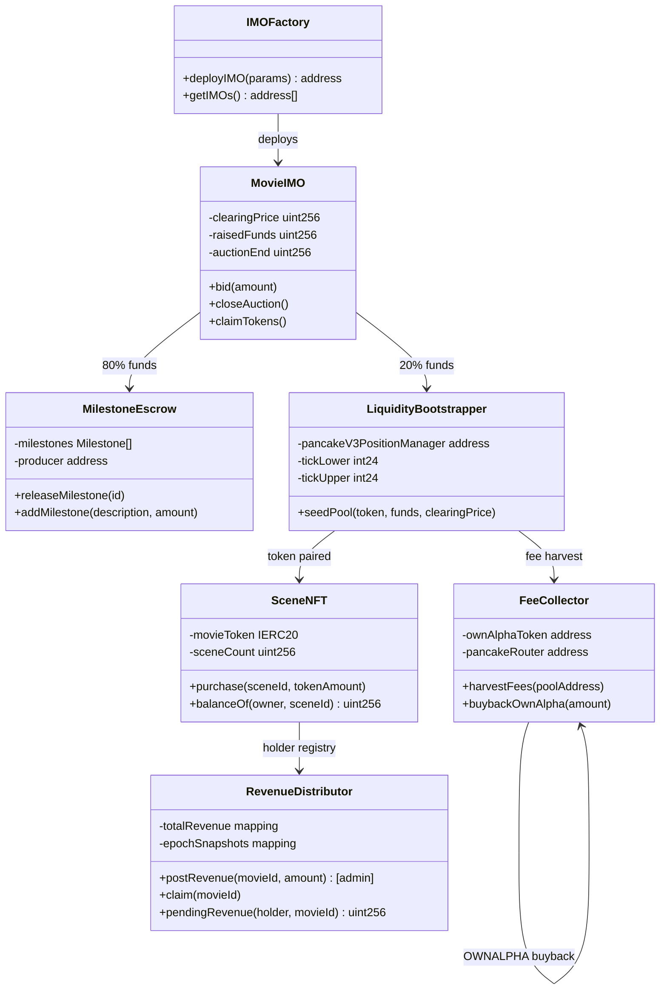
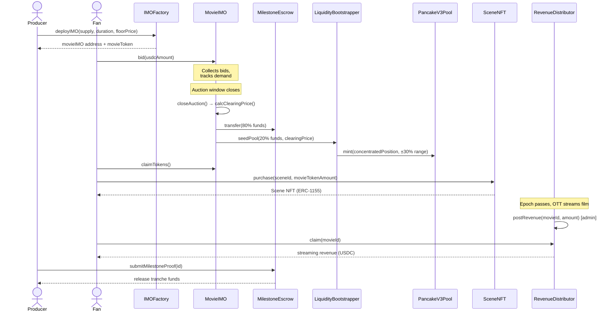

# OwnAlpha — Technical Documentation

## Architecture Overview

OwnAlpha is a Next.js 14 frontend connected to a suite of Solidity smart contracts on BNB Chain (BSC). The protocol is split into five contract modules that interact sequentially through the movie lifecycle.

### Contract Architecture



### Contract Interaction Flow



---

## Smart Contracts Reference

### `IMOFactory.sol`
Deploys and tracks `MovieIMO` instances. The producer-facing entry point.

**Key parameters:**
```solidity
struct IMOParams {
    string movieTitle;
    address movieToken;        // pre-deployed ERC-20 or deploy new
    uint256 auctionSupply;     // tokens committed to IMO
    uint256 duration;          // auction window in seconds (min 24h, max 31 days)
    uint256 floorPrice;        // minimum clearing price in USDC (18 decimals)
    uint256 lpSplitBps;        // basis points for LP seed (default: 2000 = 20%)
}
```

### `MovieIMO.sol`
Handles bid collection and pro-rata / clearing price distribution.

- Bids accepted in USDC
- On `closeAuction()`: excess bids refunded, clearing price computed, `LiquidityBootstrapper` and `MilestoneEscrow` funded
- `claimTokens()`: bidders claim at clearing price

### `LiquidityBootstrapper.sol`
Seeds PancakeSwap v3 with protocol-owned concentrated liquidity.

- Receives 20% of raised USDC + equal-value movie tokens (at clearing price)
- Computes `tickLower` / `tickUpper` from clearing price ±30%
- Mints position via `INonfungiblePositionManager`
- Protocol holds the NFT position — no external LPs needed at launch

### `MilestoneEscrow.sol`
Holds 80% of raised funds, releasing in tranches as the producer proves delivery.

- Milestones set at IMO creation (e.g. "Principal photography complete", "Festival submission")
- Admin (legal multi-sig) attests milestone completion → funds released
- Producer default → DAO vote to claw back remaining escrowed funds

### `SceneNFT.sol` (ERC-1155)
Token-gated scene ownership.

```solidity
function purchase(uint256 sceneId, uint256 tokenAmount) external {
    require(movieToken.transferFrom(msg.sender, address(this), tokenAmount));
    _mint(msg.sender, sceneId, 1, "");
    // tokens locked in contract (burned on scene NFT burn)
}
```

- Scene IDs correspond to specific timestamped segments of the film
- `tokenAmount` required per scene set at movie launch
- Locked tokens released if NFT is burned back (v2 feature)

### `RevenueDistributor.sol`
Epoch-based pro-rata streaming revenue distribution.

```solidity
function postRevenue(uint256 movieId, uint256 amount) external onlyAdmin {
    // admin (v1) or oracle (v2) posts USDC revenue per epoch
    totalRevenue[movieId] += amount;
    snapshots[movieId].push(EpochSnapshot(block.number, totalRevenue[movieId]));
}

function claim(uint256 movieId) external {
    uint256 scenes = sceneNFT.balanceOf(msg.sender, movieId);
    uint256 totalScenes = sceneNFT.totalSupply(movieId);
    uint256 claimable = (scenes * availableRevenue(movieId)) / totalScenes;
    // transfer USDC to claimant
}
```

### `FeeCollector.sol`
Harvests fees from all protocol-owned PancakeSwap v3 positions and executes $OWNALPHA buybacks.

- Called by a keeper (off-chain) or anyone (permissionless) via `harvestFees(pool)`
- Accumulated USDC/BNB swapped to $OWNALPHA via PancakeSwap router
- $OWNALPHA sent to burn address or staking contract (v2)

---

## Frontend Structure

```
src/
├── app/
│   ├── page.tsx                  # Launchpad home — browse active IMOs
│   ├── launch/page.tsx           # Producer launch wizard
│   ├── imo/[address]/page.tsx    # Individual IMO page — bid UI
│   ├── film/[id]/page.tsx        # Film detail — scenes, revenue, AMM
│   └── portfolio/page.tsx        # Fan portfolio — NFTs, claimable revenue
├── components/
│   ├── IMOCard.tsx               # IMO listing card
│   ├── BidModal.tsx              # Bid placement modal
│   ├── SceneGrid.tsx             # Scene NFT gallery + purchase
│   ├── RevenueClaimCard.tsx      # Pending + claimed streaming revenue
│   └── AMMWidget.tsx             # Token swap widget (PancakeSwap embed)
├── hooks/
│   ├── useIMO.ts                 # Read IMO state, place bids
│   ├── useSceneNFT.ts            # Mint + query scene NFTs
│   └── useRevenue.ts             # Claim streaming revenue
└── lib/
    ├── abis/                     # Contract ABIs
    ├── contracts.ts              # Address constants by chainId
    └── wagmiConfig.ts            # wagmi + viem chain config for BSC
```

---

## Setup & Run Instructions

### Prerequisites

- Node.js 18+ (`node --version`)
- npm or yarn
- MetaMask or any BSC-compatible wallet

### 1. Clone & Install

```bash
git clone https://github.com/abishekmani779-dotcom/ownalpha.git
cd ownalpha
npm install
```

### 2. Configure Environment

```bash
cp .env.example .env.local
```

Edit `.env.local`:

```env
# Chain
NEXT_PUBLIC_CHAIN_ID=97                          # 97 = BSC Testnet, 56 = Mainnet

# RPC
NEXT_PUBLIC_RPC_URL=https://data-seed-prebsc-1-s1.binance.org:8545/

# Contract Addresses (BSC Testnet — see bsc.address)
NEXT_PUBLIC_IMO_FACTORY_ADDRESS=0x...
NEXT_PUBLIC_SCENE_NFT_ADDRESS=0x...
NEXT_PUBLIC_REVENUE_DISTRIBUTOR_ADDRESS=0x...
NEXT_PUBLIC_FEE_COLLECTOR_ADDRESS=0x...
NEXT_PUBLIC_OWNALPHA_TOKEN=0x...

# WalletConnect (get from cloud.walletconnect.com)
NEXT_PUBLIC_WALLETCONNECT_PROJECT_ID=your_project_id
```

### 3. Run Development Server

```bash
npm run dev
```

Open [http://localhost:3000](http://localhost:3000).

### 4. Verify Contract Deployment

```bash
node check-contract.js
```

This checks that all addresses in `bsc.address` are deployed and responsive on-chain.

### 5. Get BSC Testnet BNB

- Faucet: [testnet.bnbchain.org/faucet-smart](https://testnet.bnbchain.org/faucet-smart)
- You also need testnet USDC — mint via the mock USDC contract at the address in `bsc.address`

---

## Demo Walkthrough

### As a Producer
1. Navigate to `/launch`
2. Fill in movie title, upload poster/trailer link
3. Set auction supply, duration (min 24h), floor price
4. Deploy IMO (signs two transactions: token approval + IMO creation)
5. Share the IMO link

### As a Fan (Bidder)
1. Browse launchpad at `/`
2. Click into an active IMO
3. Connect wallet (BSC Testnet)
4. Enter USDC bid amount → `Place Bid`
5. After auction closes: return to claim tokens at clearing price

### Buying a Scene NFT
1. Navigate to `/film/[id]`
2. Browse the scene grid — each scene shows token cost
3. Click `Buy Scene` — approves movie token + mints NFT
4. Scene NFT appears in `/portfolio`

### Claiming Streaming Revenue
1. Go to `/portfolio`
2. Under `Revenue`, click `Claim` on any film with pending earnings
3. USDC credited to wallet

---

## Scripts Reference

| Script | Purpose |
|---|---|
| `node check-contract.js` | Verify all deployed contracts are live and accessible |
| `npm run deploy:testnet` | Deploy full contract suite to BSC Testnet _(add script)_ |
| `npm run seed:imo` | Create a demo IMO with mock data _(add script)_ |

---

## Known Technical Limitations (v1)

| Limitation | Workaround | V2 Plan |
|---|---|---|
| Revenue oracle is admin-only | Manual admin call after each epoch | Chainlink + OTT API webhook |
| LP rebalancing is manual | Admin triggers harvest + redeploy | Automated keeper (Gelato) |
| No Scene NFT secondary market | Fans hold long-term | Peer-to-peer listing (movie-token denominated) |
| Single concentrated LP range | Covers ±30% of clearing price | Dynamic range rebalancing |
